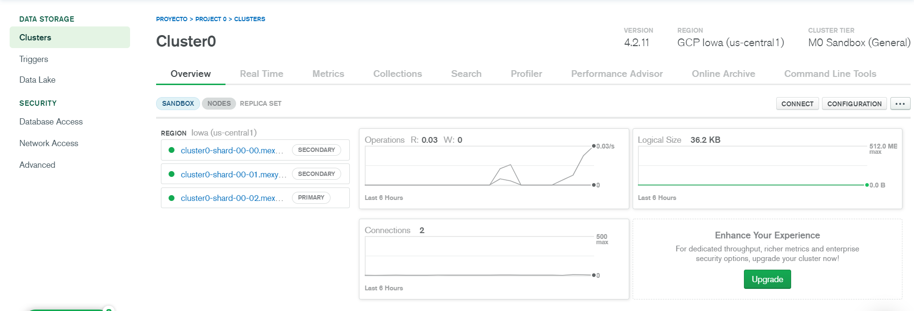
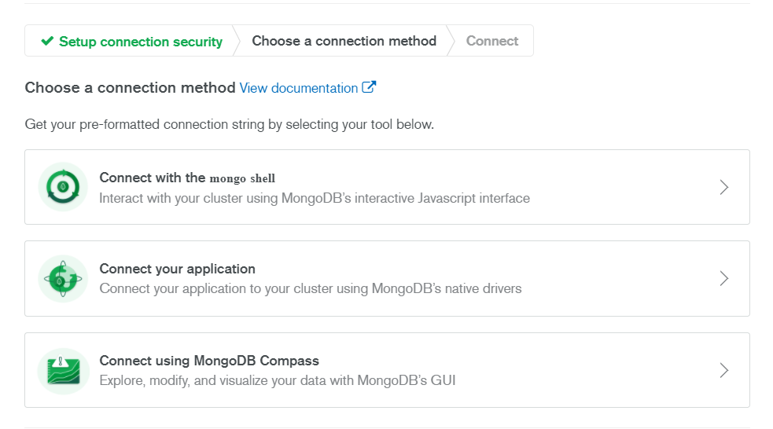
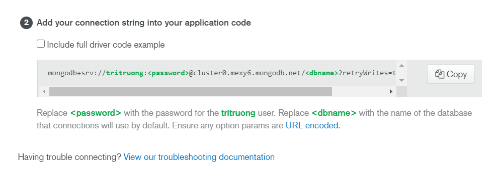
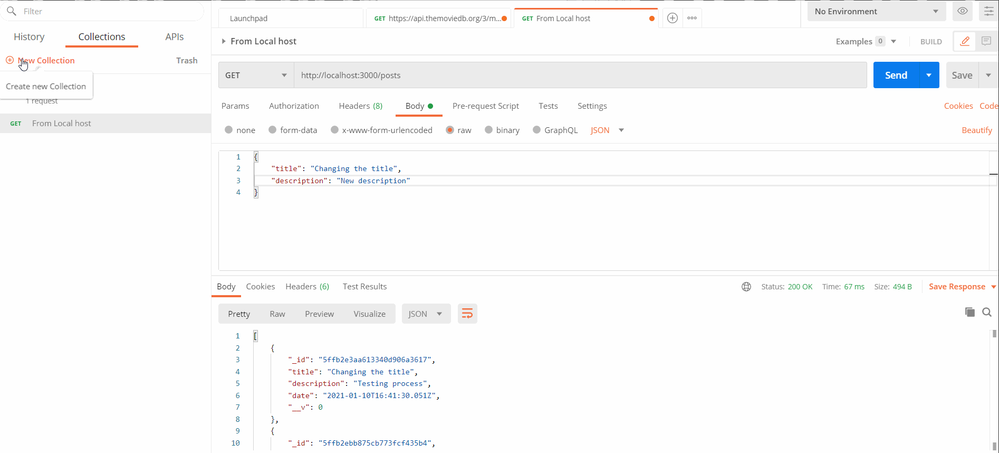

# RESTFUL API tutorial

### Steps

1. Create package.json file  
   <code>npm init</code>
2. Install express and nodemon (nodemon serves like a live server for node.js)  
   <code>npm install express nodemon</code>
3. Add code to run npm, in **package.json** file and inside **"scripts"** add the following code  
   <code>
   "start": "nodemon app.js"
   </code>
4. Create **app.js** file
5. Connect to MongoDB using mongoose  
   <code>npm install mongoose</code>
6. Install dotenv package to hide information  
   <code>npm install dotenv</code>  
   Then, create a file called ".env" and put the hidden information in under a variable name

# Create MongoDB atlas using mlab.com

1. Go to mlab.com and SignUp for MongoDB account
2. After that just choose a service provider (AWS, GCP), your choice
3. Choose the Connect button on the left side of the screen  
   
4. You will need to setup your UserId and password.
5. After that, choose the **Connect your application** option  
   
6. Paste the link they give into the code
   
7. Replace the **\<password>** with your password and give a name (your choice) for the **\<dbname>**

# Connect to the Database

<code>
mongoose.connect(
  process.env.DB_CONNECTION,
  { useNewUrlParser: true, useUnifiedTopology: true },
  () => {
    console.log("Connected to DB");
  }
);</code>

# Create routes using middlewares

Using **express.Router** to set up routes and import that into the main Javascript file using app.use (aka. middlewares)

# Create a model for database

1. Create a model file **Post.js** in modules folder to setup an outline for the post
2. Import the Post model into the posts.js file in routes to start creating, reading, deleting, or updating the posts

# using Postman for GET and POST

1. Download Postman application
2. SignUp for an account
3. Create new Collection and new request
   

# Enable Cross Region API fetching

1. Install cors: <code>npm install cors</code>
2. Create a middleware in the main js file to inable cors  
   <code>
   const cors = require("cors");  
   app.use(cors());
   </code>

# To use the simple app

1. Clone the Project
2. Install the packages: <code>npm install</code>
3. Create a new Database (mentioned above)
4. Change the code to connect to the database (mentioned above)
5. Run the server: <code>nodemon app.js</code>
6. Create the PostMan account the try requesting the api from your local host
7. Fetch the data from other javascript file

# Credit

> Tutorial Video: [Build A Restful Api With Node.js Express & MongoDB | Rest Api Tutorial](https://www.youtube.com/watch?v=vjf774RKrLc&t=2449s)
